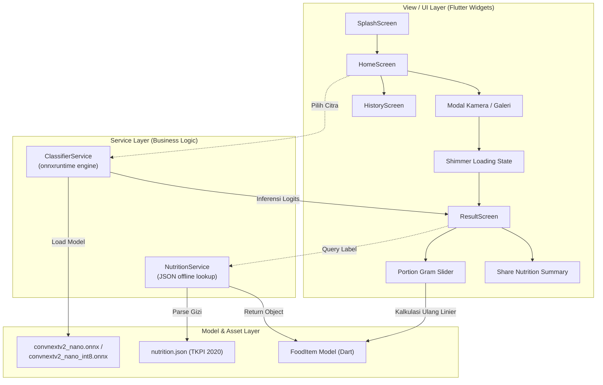

# Nutrisi Nusantara AI — Mobile Application (Flutter Client)

> **Aplikasi Mobile Edge-AI untuk Klasifikasi 100 Makanan Indonesia & Estimasi Nutrisi Otomatis Berbasis ONNX Runtime Mobile & TKPI 2020**  
> *Dikembangkan untuk Tugas Akhir S1 Informatika*

---

## Daftar Isi
1. [Gambaran Aplikasi](#1-gambaran-aplikasi)
2. [Arsitektur & Pola Desain Mobile](#2-arsitektur--pola-desain-mobile)
3. [Fitur-Fitur Utama](#3-fitur-fitur-utama)
4. [Struktur Direktori Aplikasi](#4-struktur-direktori-aplikasi)
5. [Prasyarat & Lingkungan Pengembangan](#5-prasyarat--lingkungan-pengembangan)
6. [Panduan Instalasi & Menjalankan](#6-panduan-instalasi--menjalankan)
7. [Integrasi Model ONNX & Manajemen Aset](#7-integrasi-model-onnx--manajemen-aset)
8. [Konfigurasi Izin Sistem (Permissions)](#8-konfigurasi-izin-sistem-permissions)
9. [Panduan Build Release (APK & App Bundle)](#9-panduan-build-release-apk--app-bundle)
10. [Troubleshooting & Solusi Kendala Umum](#10-troubleshooting--solusi-kendala-umum)
11. [Argumen Ilmiah Pemilihan Flutter untuk Sidang TA](#11-argumen-ilmiah-pemilihan-flutter-untuk-sidang-ta)

---

## 1. Gambaran Aplikasi

Aplikasi **Nutrisi Nusantara AI** adalah antarmuka pengguna (*mobile client*) yang menjalankan inferensi *Convolutional Neural Network* (CNN) SOTA langsung pada perangkat smartphone (*on-device inference*). Pengguna cukup mengambil foto makanan Indonesia atau memilih gambar dari galeri, lalu dalam hitungan milidetik aplikasi akan:

1. Mengenali makanan dari **100 kelas kuliner nusantara**.
2. Menyajikan **3 kandidat prediksi teratas (Top-3)** beserta nilai probabilitasnya.
3. Menghitung rincian **makronutrien (energi, protein, lemak, karbohidrat, serat)** berdasarkan basis data **TKPI 2020 (Kemenkes RI)**.
4. Memungkinkan penyesuaian porsi santapan secara dinamis (**10 gram s.d. 1000 gram**) dengan kalkulasi instan.
5. Membandingkan kandungan gizi terhadap **Angka Kecukupan Gizi (AKG)** harian masyarakat Indonesia.
6. Menyimpan riwayat pemindaian secara lokal (*offline scan history*) dan memfasilitasi pembagian ringkasan gizi.

---

## 2. Arsitektur & Pola Desain Mobile

Aplikasi dibangun menggunakan pola arsitektur **Model-View-Service (MVS)** yang *decoupled*, menjamin modularitas, kebersihan kode, dan kemudahan pemeliharaan (*maintainability*):



### Keunggulan Arsitektur:
- **100% Offline-First**: Tidak memerlukan koneksi internet untuk inferensi maupun pencarian gizi. Privasi foto pengguna terjamin penuh di dalam perangkat.
- **Ultra-Low Latency**: Waktu inferensi pada CPU perangkat bergerak berkisar antara **11.6 ms (INT8)** hingga **21.1 ms (FP32)**.
- **Stateless ML Pipeline**: Image preprocessing dilakukan pada memori lokal menggunakan pustaka `image` Dart sebelum disalurkan ke `onnxruntime`.

---

## 3. Fitur-Fitur Utama

| Fitur | Deskripsi | Layar / Komponen |
|:---|:---|:---|
| **Capture & Pick Image** | Pengambilan citra melalui kamera langsung atau memilih dari galeri ponsel | `HomeScreen` (`image_picker`) |
| **Edge AI Classification** | Inferensi lokal model SOTA ConvNeXt V2-Nano dengan Softmax probabilities | `ClassifierService` (`onnxruntime`) |
| **Top-3 Candidates** | Menampilkan 3 prediksi teratas untuk transparansi jika terjadi ambiguitas visual | `ResultScreen` |
| **Dynamic Portion Slider** | Slider takaran gram interaktif (skala porsi 10g - 1000g) yang otomatis menghitung gizi | `ResultScreen` |
| **Macronutrient Breakdown** | Diagram lingkaran interaktif (Donut/Pie Chart) komposisi kalori dari Protein, Lemak, dan Karbohidrat | `ResultScreen` (`fl_chart`) |
| **AKG Progress Bar** | Indikator persentase kontribusi per porsi terhadap Angka Kecukupan Gizi harian Indonesia (2150 kkal) | `ResultScreen` (`percent_indicator`) |
| **Nutritionist Validation Badge** | Tanda status validasi standar resep dari Ahli Gizi SPPG/BGN | `ResultScreen` |
| **Scan History** | Catatan riwayat makanan yang pernah dipindai sebelumnya | `HistoryScreen` |
| **Share Nutrition Card** | Membagikan teks ringkasan asupan gizi ke aplikasi perpesanan atau media sosial | `ResultScreen` (`share_plus`) |

---

## 4. Struktur Direktori Aplikasi

```
mobile_app/
├── assets/
│   ├── nutrition.json                # Basis data gizi 100 makanan (TKPI 2020 terkompilasi)
│   └── models/
│       ├── convnextv2_nano.onnx      # Bobot model FP32 (opsional, ukuran ~59.5 MB)
│       └── convnextv2_nano_int8.onnx # Bobot model kuantisasi INT8 (~14.9 MB - Rekomendasi)
│
├── lib/
│   ├── main.dart                     # Titik masuk aplikasi & konfigurasi tema Material 3
│   ├── models/
│   │   └── food_item.dart            # Data model Dart (FoodItem, NutritionInfo, Macronutrients)
│   ├── screens/
│   │   ├── splash_screen.dart        # Layar pembuka animasi
│   │   ├── home_screen.dart          # Layar utama (kamera, galeri, quick tips)
│   │   ├── result_screen.dart        # Layar hasil deteksi, slider porsi & visualisasi gizi
│   │   └── history_screen.dart       # Layar riwayat pemindaian
│   └── services/
│       ├── classifier_service.dart   # Engine klasifikasi ONNX Runtime Mobile
│       └── nutrition_service.dart    # Service parsing & kalkulasi gizi offline
│
├── android/                          # Konfigurasi native Android (Gradle, Manifest)
├── ios/                              # Konfigurasi native iOS (Podfile, Info.plist)
└── pubspec.yaml                      # Dependensi pustaka Flutter & deklarasi aset
```

---

## 5. Prasyarat & Lingkungan Pengembangan

Sebelum menjalankan atau membangun aplikasi, pastikan perangkat pengembang memenuhi prasyarat berikut:

1. **Flutter SDK**: Versi `3.10.0` atau yang lebih baru (channel `stable`).
   ```bash
   flutter --version
   ```
2. **Dart SDK**: Versi `^3.0.0`.
3. **Android Studio / VS Code**: Terpasang plugin Flutter dan Dart.
4. **Android SDK**:
   - `compileSdkVersion`: 34
   - `minSdkVersion`: 24 (Android 7.0 Nougat — syarat library ONNX Runtime)
   - `targetSdkVersion`: 34
5. **Java Development Kit (JDK)**: JDK 17 (disarankan temurin-17 atau OpenJDK 17).
6. **Perangkat Pengujian**:
   - Smartphone fisik Android dengan USB Debugging aktif (Sangat disarankan untuk pengujian kamera & latensi riil).
   - ATAU Android Emulator (Android 10+ dengan Google Play Services).

---

## 6. Panduan Instalasi & Menjalankan

### Langkah 1: Pindah ke Direktori `mobile_app`
Buka terminal pada root proyek Tugas Akhir dan masuk ke folder aplikasi:
```bash
cd mobile_app
```

### Langkah 2: Unduh Seluruh Dependensi Dart
Jalankan perintah `flutter pub get` untuk mengunduh semua pustaka:
```bash
flutter pub get
```

### Langkah 3: Siapkan File Model ONNX
Pastikan file model ONNX hasil ekspor dari Tahap 8 (`08_mobile_conversion.py`) telah disalin ke folder aset:
```bash
# Struktur yang diharapkan:
mobile_app/assets/models/convnextv2_nano_int8.onnx
mobile_app/assets/nutrition.json
```
*(Jika file model belum diekspor, salin model dummy atau jalankan skrip `08_mobile_conversion.py` terlebih dahulu).*

### Langkah 4: Periksa Kesiapan Perangkat (Device Check)
Cek perangkat yang terhubung:
```bash
flutter devices
```

### Langkah 5: Jalankan Aplikasi dalam Mode Debug
```bash
flutter run
```
Untuk mengarahkan ke perangkat spesifik:
```bash
flutter run -d <DEVICE_ID>
```

---

## 7. Integrasi Model ONNX & Manajemen Aset

### Konfigurasi Aset pada `pubspec.yaml`:
```yaml
flutter:
  uses-material-design: true

  assets:
    - assets/nutrition.json
    - assets/models/convnextv2_nano.onnx
    - assets/models/convnextv2_nano_int8.onnx
```

### Alur Kerja Inferensi di `ClassifierService`:
1. **Model Loading**: Membaca *byte array* model dari bundle aset aplikasi saat inisialisasi pertama kali:
   ```dart
   final rawAsset = await rootBundle.load('assets/models/convnextv2_nano_int8.onnx');
   final session = OrtSession.fromBuffer(rawAsset.buffer.asUint8List(), sessionOptions);
   ```
2. **Preprocessing Citra**:
   - Gambar masukan di-*resize* ke resolusi $224 \times 224$ piksel.
   - Normalisasi nilai kanal RGB dengan konstanta ImageNet:
     $$\mu = [0.485, 0.456, 0.406], \quad \sigma = [0.229, 0.224, 0.225]$$
   - Mengubah matriks $H \times W \times C$ menjadi tensor input NCHW: $[1, 3, 224, 224]$ dalam format `Float32List`.
3. **Session Run**: Menjalankan komputasi tensor pada CPU/NNAPI smartphone.
4. **Softmax & Top-K**: Menghitung probabilitas dari 100 nilai logit keluaran dan menyaring 3 kelas dengan skor tertinggi.

---

## 8. Konfigurasi Izin Sistem (Permissions)

### Android (`android/app/src/main/AndroidManifest.xml`)
Pastikan izin-izin berikut telah dideklarasikan di dalam tag `<manifest>`:

```xml
<!-- Izin Akses Kamera untuk Foto Makanan -->
<uses-permission android:name="android.permission.CAMERA" />
<uses-feature android:name="android.hardware.camera" android:required="false" />
<uses-feature android:name="android.hardware.camera.autofocus" android:required="false" />

<!-- Izin Akses Galeri (Android 12 ke bawah) -->
<uses-permission android:name="android.permission.READ_EXTERNAL_STORAGE" android:maxSdkVersion="32" />

<!-- Izin Akses Foto (Android 13 Tiramisu / API 33+) -->
<uses-permission android:name="android.permission.READ_MEDIA_IMAGES" />
```

### iOS (`ios/Runner/Info.plist`)
Jika aplikasi dijalankan di lingkungan iOS, tambahkan entri berikut pada berkas `Info.plist`:

```xml
<key>NSCameraUsageDescription</key>
<string>Aplikasi memerlukan akses kamera untuk memotret makanan dan menganalisis nutrisinya.</string>
<key>NSPhotoLibraryUsageDescription</key>
<string>Aplikasi memerlukan akses galeri untuk memilih foto makanan yang akan dianalisis.</string>
```

---

## 9. Panduan Build Release (APK & App Bundle)

Untuk demonstrasi sidang sarjana atau publikasi ke Google Play Store, bangun aplikasi dalam mode rilis teroptimasi:

### A. Build Standalone APK (Untuk Pengujian & Sidang TA)
Menghasilkan berkas APK mandiri yang dapat langsung diinstal (*sideload*) ke ponsel penguji atau dosen:
```bash
# Build fat APK (mencakup semua arsitektur CPU)
flutter build apk --release

# Output:
# build/app/outputs/flutter-apk/app-release.apk
```

Untuk menghasilkan APK yang lebih kecil berdasarkan arsitektur CPU (ARM64-v8a):
```bash
flutter build apk --release --split-per-abi

# Output khusus ponsel modern (64-bit):
# build/app/outputs/flutter-apk/app-arm64-v8a-release.apk
```

### B. Build Android App Bundle (AAB - Siap Rilis Play Store)
```bash
flutter build appbundle --release

# Output:
# build/app/outputs/bundle/release/app-release.aab
```

---

## 10. Troubleshooting & Solusi Kendala Umum

### 1. `minSdkVersion error` saat build Android
- **Penyebab**: Pustaka `onnxruntime` memerlukan Android API Level minimal 24.
- **Solusi**: Buka `android/app/build.gradle`, cari `defaultConfig` dan pastikan:
  ```groovy
  defaultConfig {
      minSdkVersion 24
      targetSdkVersion 34
  }
  ```

### 2. Layar Hitam saat Membuka Kamera
- **Penyebab**: Pengguna belum memberikan izin kamera (*permission denied*).
- **Solusi**: Masuk ke Pengaturan Ponsel > Aplikasi > Nutrisi Nusantara AI > Izin > Izinkan Kamera, atau instal ulang aplikasi untuk memicu dialog izin ulang.

### 3. Error `Asset not found: assets/models/convnextv2_nano_int8.onnx`
- **Penyebab**: File model belum disalin ke direktori `assets/models/` atau belum terdaftar di `pubspec.yaml`.
- **Solusi**: Periksa keberadaan file dan jalankan `flutter clean` diikuti `flutter pub get`.

### 4. Peringatan Memori / FPS Rendah pada Ponsel Lama
- **Penyebab**: Menggunakan model FP32 (59.5 MB) pada perangkat dengan RAM terbatas.
- **Solusi**: Gunakan model kuantisasi INT8 (`convnextv2_nano_int8.onnx`, ukuran 14.9 MB) yang memangkas beban memori hingga 75% dan melipatgandakan kecepatan inferensi ($2.4\times$).

---

## 11. Argumen Ilmiah Pemilihan Flutter untuk Sidang TA

Berikut poin-poin ilmiah yang dapat disampaikan saat menjawab pertanyaan dewan penguji terkait aspek implementasi mobile:

1. **Efisiensi Single Codebase Tanpa Reduksi Performa**:
   - Flutter mengompilasi kode Dart langsung ke kode mesin (*native ARM machine code*), bukan melalui lapisan JavaScript bridge seperti React Native. Hal ini menghasilkan waktu respons UI yang konsisten pada 60 FPS.
2. **Dukungan Resmi ONNX Runtime Mobile**:
   - Melalui plugin `onnxruntime`, Flutter dapat langsung mengeksekusi komputasi tensor C++ engine dari Microsoft tanpa overhead serialisasi data antar-bahasa, memberikan performa setara dengan aplikasi native Android (Kotlin/C++ NDK).
3. **Pemisahan Logika & Tampilan (Decoupled Layer)**:
   - Antarmuka mobile bertindak murni sebagai *inference client* dan *calculator*. Jika basis data gizi TKPI mengalami pembaruan atau model dilatih ulang dengan kelas tambahan, cukup dilakukan penggantian berkas aset tanpa perlu mendesain ulang arsitektur antarmuka pengguna.

---
*© 2026 Tim Peneliti Tugas Akhir S1 Informatika — Nutrisi Nusantara AI*
